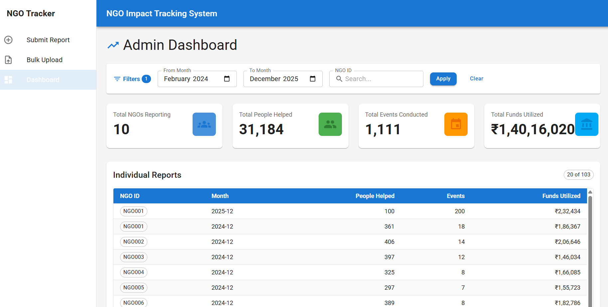
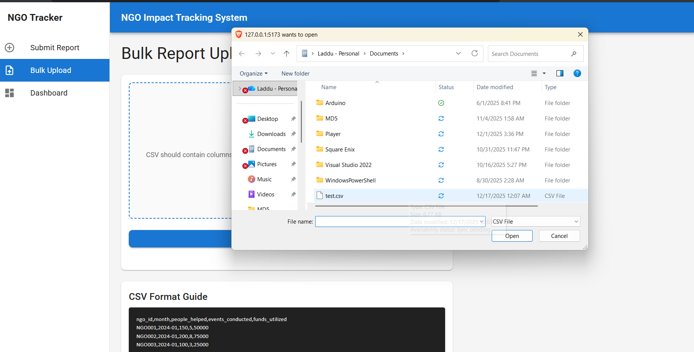
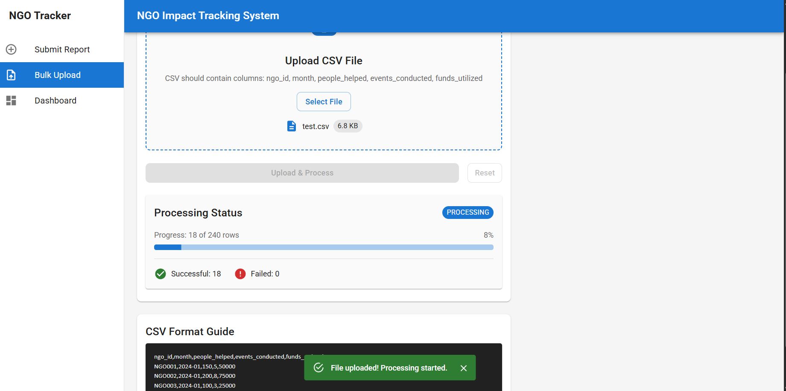
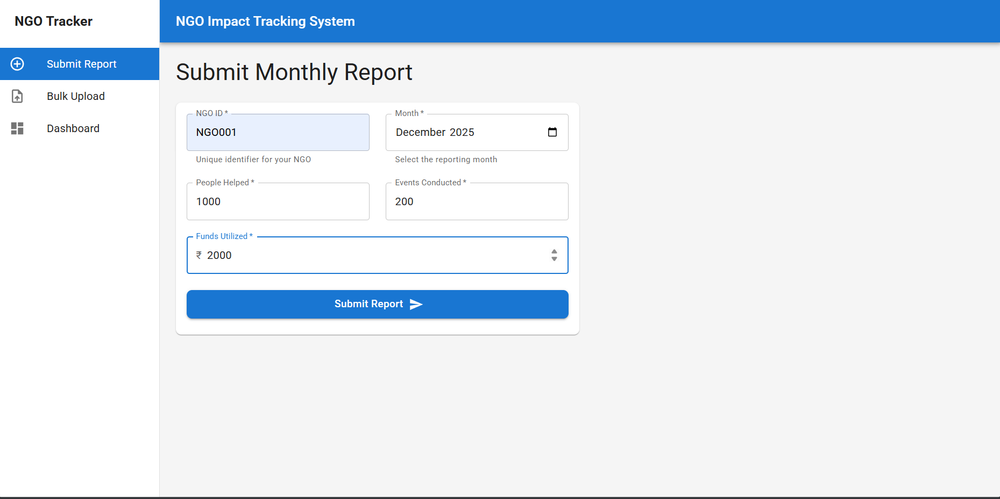
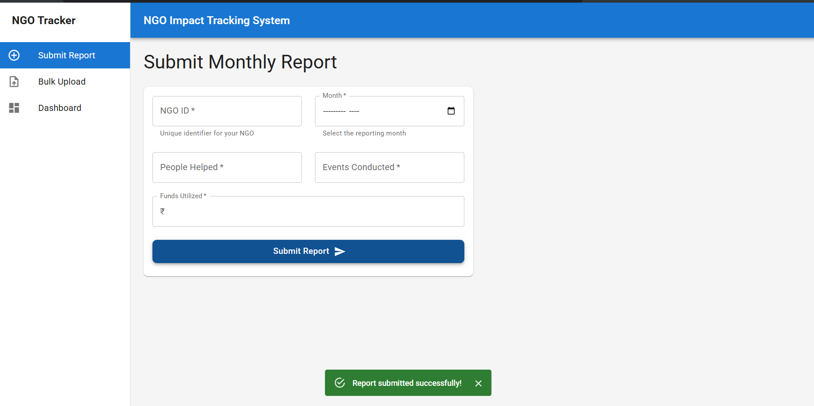

# ngo impact tracker (monorepo)

one repo. two apps:

* **frontend** (react + vite + mui)
* **backend** (node + express + sqlite)

## folders

* `frontend/` ui
* `backend/` api + db

## run locally

### 1) backend

```bash
cd backend
npm install
npm run dev
```

runs on `http://localhost:3001`
api base: `http://localhost:3001/api`

### 2) frontend

open new terminal:

```bash
cd frontend
npm install
npm run dev
```

runs on `http://localhost:5173`

## env (frontend)

create `frontend/.env`:

```env
VITE_API_URL=http://localhost:3001/api
```

## what to click in UI

* **report form**: submit one report
* **bulk upload**: upload csv, then it shows job progress
* **dashboard**: totals + table + filters + infinite scroll

## csv format

```csv
ngo_id,month,people_helped,events_conducted,funds_utilized
NGO001,2024-01,150,5,50000
```

## api quick list

* `POST /api/report`
* `POST /api/reports/upload`
* `GET /api/job-status/:jobId`
* `GET /api/dashboard?month=YYYY-MM` (or `month_from`, `month_to`, `ngo_id`, `offset`, `limit`)
* `GET /api/reports`

## screenshots

### admin dashboard
overview of aggregated metrics, filters, and report table.



---

### bulk csv upload
async background processing with live progress tracking.





---

### submit monthly report
single report submission with validation and success feedback.






## deploy note

* Frontend (Vercel): https://ngo-impact-tracker-five.vercel.app
* Backend (Render): https://ngo-impact-tracker-iiq2.onrender.com


## AI Tools Used

ChatGPT was used for debugging support and README documentation.

## What I’d Improve Next (Production)

* Real job queue (BullMQ/Redis) instead of in-process background task
* Auth for admin dashboard
* Better observability (structured logs, metrics)
* Retry support for failed CSV rows
* Rate limiting + request validation middleware
